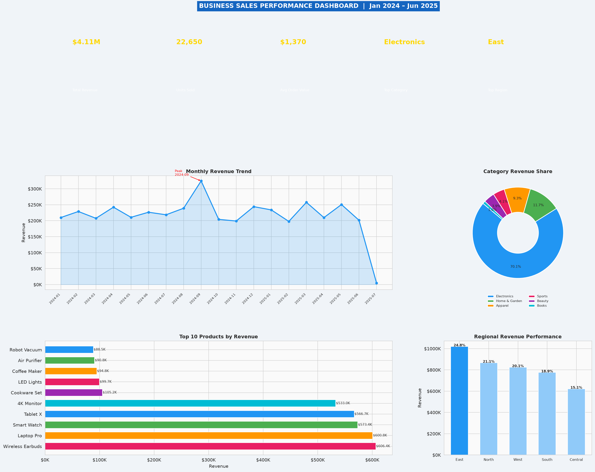
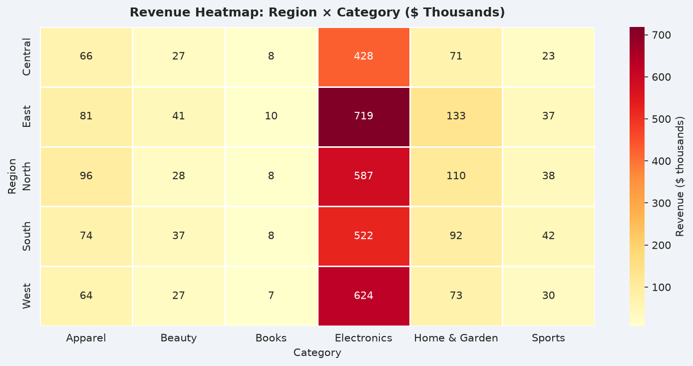

# 📊 Business Sales Performance Analytics

A Python-based analytics project that generates a synthetic sales dataset, computes key business KPIs, and produces a client-ready visual dashboard, heatmap, and actionable recommendations report — all from a single script.



---

## 🚀 Features

- **Synthetic dataset generator** — creates 3,000 realistic sales transactions across 5 regions, 6 categories, and 30 products (Jan 2024 – Jun 2025)
- **KPI summary** — total revenue, units sold, average order value, top category/region/product
- **6-panel visual dashboard** — KPI banner, monthly revenue trend, category revenue share, top 10 products, and regional performance
- **Region × Category heatmap** — quickly spot where revenue is concentrated
- **Automated insights & recommendations** — printed report covering category/regional performance, MoM growth, and discount impact
- **Excel export** — full raw dataset saved for further analysis

---

## 📁 Project Structure

```
.
├── sales_analysis.py            # Main script — generates data, charts, and report
├── sales_analysis_explained.md  # Line-by-line explanation of the code
├── sales_data.xlsx              # Generated dataset (3,000 transactions)
├── sales_dashboard.png          # Generated 6-panel KPI dashboard
├── sales_heatmap.png            # Generated Region × Category heatmap
└── README.md
```

---

## 🖼️ Sample Output

### Dashboard


### Heatmap


---

## 🛠️ Tech Stack

| Library | Purpose |
|---|---|
| [pandas](https://pandas.pydata.org/) | Data structuring, grouping, pivoting, Excel export |
| [numpy](https://numpy.org/) | Random data generation with reproducible seeding |
| [matplotlib](https://matplotlib.org/) | Core charting and dashboard layout (GridSpec) |
| [seaborn](https://seaborn.pydata.org/) | Styling and the Region × Category heatmap |

---

## ⚙️ Installation & Usage

### 1. Clone the repository
```bash
git clone https://github.com/<your-username>/<your-repo-name>.git
cd <your-repo-name>
```

### 2. Create a virtual environment (recommended)
```bash
python -m venv venv
source venv/bin/activate        # On Windows: venv\Scripts\activate
```

### 3. Install dependencies
```bash
pip install pandas numpy matplotlib seaborn openpyxl
```

### 4. Run the script
```bash
python sales_analysis.py
```

This will:
1. Generate the synthetic dataset and save it to `sales_data.xlsx`
2. Print KPIs and insights/recommendations to the console
3. Save `sales_dashboard.png` and `sales_heatmap.png` in the project folder

---

## 📈 Key Insights Generated

The script automatically prints a report covering:

- Revenue breakdown by **category** and **region**
- **Month-over-month revenue growth**, including the best-performing month
- **Discount impact analysis** — revenue lost to heavy discounting
- A list of **actionable business recommendations** based on the data

---

## 📖 Code Walkthrough

For a detailed, line-by-line explanation of every function and chart used in `sales_analysis.py`, see [`sales_analysis_explained.md`](sales_analysis_explained.md).

---

## 🔄 Reproducibility

The dataset is generated using `np.random.seed(42)`, so running the script multiple times will always produce the **same data and charts** — useful for consistent demos and testing.

---

## 📝 License

This project is open source and available under the [MIT License](LICENSE).

---

## 🙋 Author

Feel free to open an issue or submit a pull request if you'd like to contribute or suggest improvements.
